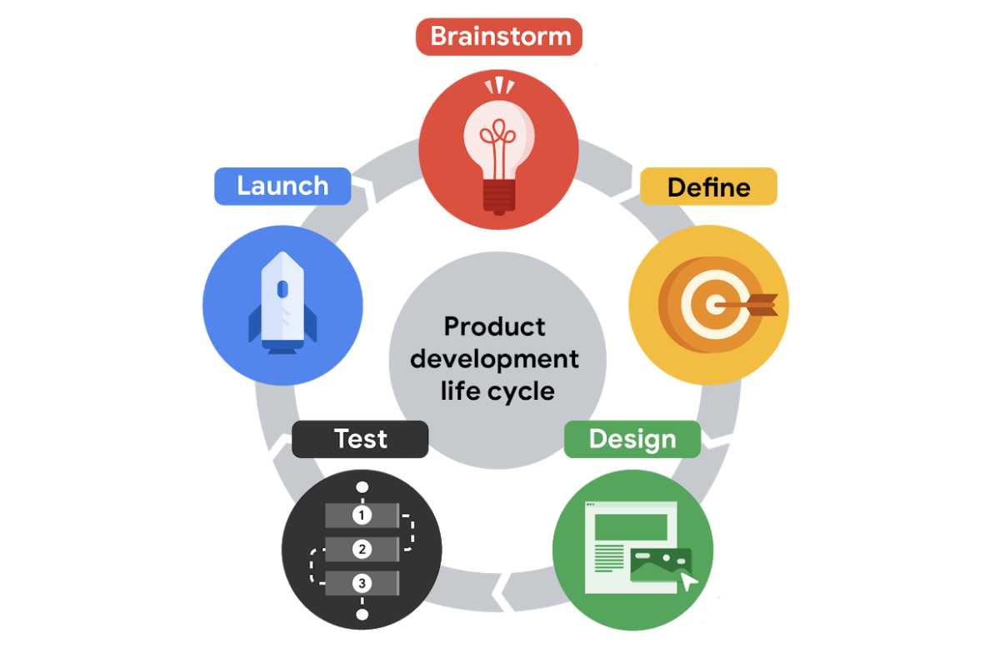

# O que é UX?
A sigla vem de User Experience, e esse termo é utilizado para definir a experiência que o usuário tem ao interagir com o produto. Alguns pontos principais é que o produto seja:

- **Usabilidade**: O produto deve ser fácil de usar.
- **Justo**: O produto deve ser ético e não prejudicar o usuário.
- **Agradável**: O produto deve ser agradável de se usar.
- **Útil**: O produto deve resolver um problema do usuário.

## Por que o UX é importante?
Independente do setor as empresas que se concentram em boa usabilidade e design tem um desempenho melhor que a concorrencia. Isso devido ao fator das pessoas gostarem de usar o produto e recomendarem para outras pessoas.

## Quais tipos de UX existem?
Uma caracteristica que todos tem em comum é a `Empatia - Entender o usuário e suas necessidades, pensando em equidade e inclusão na hora de criar o produto.` e para isso cada tipo de UX design tem um foco diferente.

### UX de Interação
Foca na interação do usuário com o produto, como ele navega, clica e interage com o produto.

### UX visual
Foca na parte visual do produto, como cores, tipografia, imagens e ícones.

### UX de movimento
Foca na animação do produto, como transições, movimentos e efeitos.

## Quais são os papéis que o UX Designer pode desempenhar
- **UX Researcher**: Foca em entender o usuário e suas necessidades.
- **UX Writer**: Foca em criar textos que ajudem o usuário a entender o produto.
- **Product Designer**: Foca em criar o produto, desde a ideia até a implementação.
- **UX Engineer**: Foca em implementar o design do produto, criando os `Assets` de design.
- **UX Manager**: Foca em gerenciar a equipe de UX Designers e garantir que o produto tenha uma boa experiência.

> Assets são os elementos de design que são utilizados para criar o produto, como imagens, ícones, fontes, cores, etc.

## Ciclo de vida de desenvolvimento de um produto

O ciclo de vida de desenvolvimento de um produto é dividido em 5 etapas:
- Brainstorm: Onde a ideia do produto é criada.
- Definição: Onde o produto é definido, como ele vai funcionar e qual problema ele resolve.
- Design: Onde o produto é desenhado, como ele vai ser visualmente.
- Testes: Onde o produto é testado com usuários reais.
- Lançamento: Onde o produto é lançado para o público.

