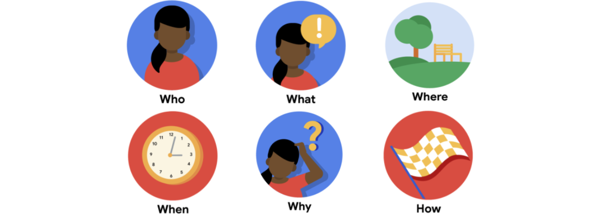

# Introdução a fase definição
Após a etapa de empatia, vem a de definição, onde temos o objetivo de definir quais são os problemas e declaramos as hipóteses para resolver esses problemas. Nessa etapa, é importante que a equipe tenha uma visão clara do problema e que todos estejam alinhados com o objetivo.

## Definição do problema
Com as histórias dos usuários e os mapas da jornada do usuário à sua frente, um designer pode identificar melhor as necessidades do usuário que seu design deve atender. É aqui que entram as definições do problema: Uma definição do problema resume quem é o usuário, o que ele precisa de um design e por quê. Aqui está um modelo simples:

[Nome do perfil do usuário] é um [tipo de usuário] que precisa de [tipo de experiência do usuário] porque [benefícios da experiência do usuário].

## Framework dos 5 Ws e 1 H
A estrutura mais comum usada para criar definições do problema é a estrutura dos 5 Ws e H. Depois de definir os pontos de dor do usuário, é possível responder quem, o quê, quando, onde, por que e como resolver o problema do usuário.

