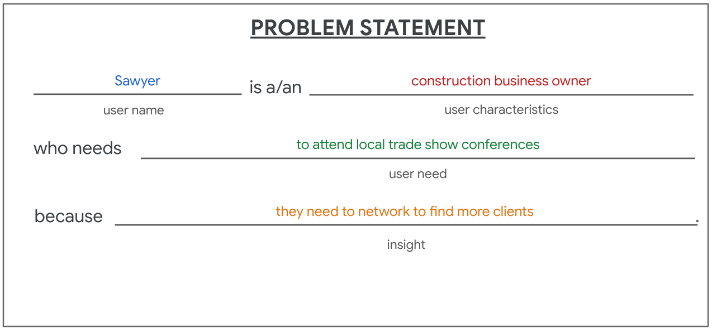
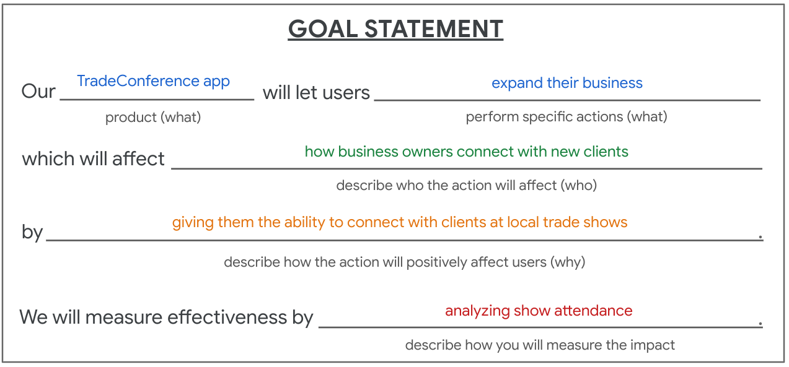

# Criando metas
Com o 5W e 1H definido, é hora de criar metas. As metas são objetivos que você deseja alcançar. Elas devem ser claras, específicas, mensuráveis, alcançáveis, relevantes e temporais. Ou seja, devem ser SMART.

Exemplo:

*(Sawyer é proprietário de uma empresa de construção civil que precisa participar de conferências comerciais locais porque precisa fazer uma rede de computadores para encontrar mais clientes.)*

Com o problema definido, criaremos a meta que funciona da seguinte forma:

*Nosso [produto] permitirá que os usuários [realizem ações específicas] que afetarão [descreva quem a ação afetará] por [descreva como a ação os afetará positivamente]. Mediremos a eficácia com [descreva como você medirá o impacto].*

Usando esse modelo, podemos escrever rapidamente uma meta definida que aborde o problema do usuário identificado na definição do problema acima:

*Nosso aplicativo TradeConference permitirá que os usuários expandam seus negócios, o que afetará a forma como os proprietários de empresas se conectam com novos clientes, dando-lhes a capacidade de se conectar com clientes em feiras locais. Mediremos a eficácia analisando a participação em feiras.*

