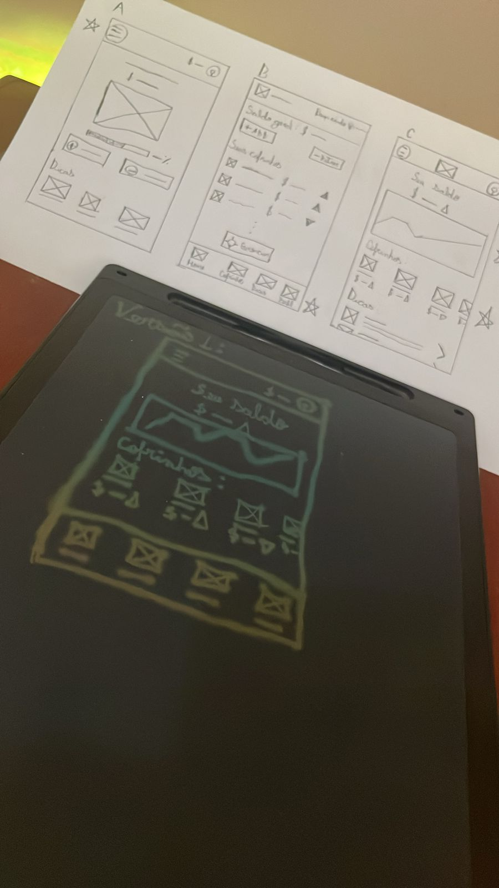

# Arquitetura de informação (IA)
Ele é como um mapa de seu produto.

A arquitetura da informação é composta de três partes:

- Organização: A organização é como as diferentes informações se conectam em um produto.

- Hierarquia: A hierarquia é geralmente chamada de "estrutura em árvore" e é onde uma categoria maior é colocada no topo e categorias específicas relacionadas à categoria geral são colocadas embaixo. As informações dos pares são colocadas lado a lado (ou no mesmo nível umas das outras).

- Sequência: A sequência permite que os usuários percorram um aplicativo por meio de determinadas ordens ou etapas.

Compreender a organização, a hierarquia e a sequência ajuda a orientar o processo de criação de um sitemap, portanto, é bom se familiarizar com esses conceitos.

## Wireframes de papel
Apesar de fazer wireframes digitais tenham a mesma função, fazer wireframes de papel é uma maneira mais rápida e fácil de fazer wireframes. Eles são úteis para testar ideias rapidamente e fazer alterações sem ter que refazer todo o wireframe.

## Wireframes digitais
Embora os wireframes de papel sejam úteis, os wireframes digitais são mais fáceis de compartilhar e editar. Existem muitas ferramentas de wireframe digital disponíveis, como Sketch, Figma, Adobe XD e Balsamiq.

