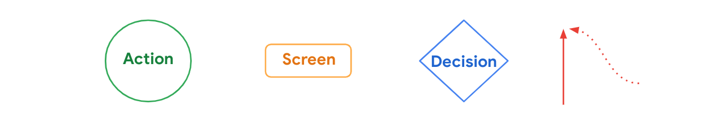
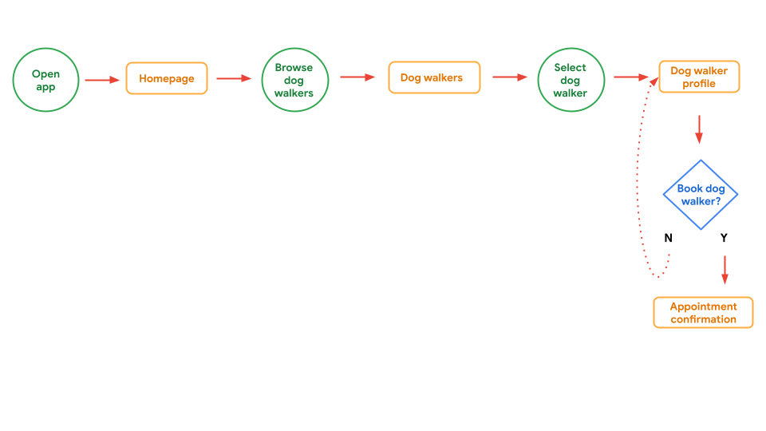

# Fluxo do usuário
O fluxo do usuário é a sequência de ações que o usuário realiza para atingir um objetivo. O fluxo do usuário é uma representação visual da jornada do usuário em um aplicativo ou site. Ele mostra o caminho que o usuário percorre para concluir uma tarefa ou atingir um objetivo.

Criamos tipo um mapa de navegação para o usuário, onde representamos as ações por círculos, as telas por retangulos, decisões por losangos e as setas representam o caminho que o usuário percorre.

## Exemplo de um fluxo do usuário 
Para aplicar esses conceitos a um produto real, veja um exemplo de fluxo do usuário abaixo, para o aplicativo de passear com cães que foi mencionado durante o curso.

