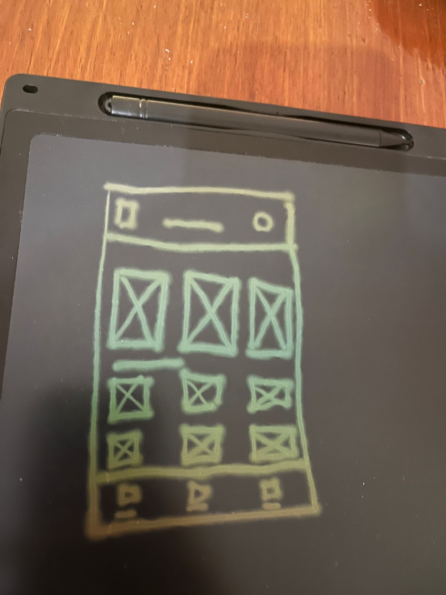

# Wireframes
Wireframes são esboços de uma interface, que servem para mostrar a estrutura e o layout de uma página. Eles são feitos antes do design final, e são uma forma de planejar a disposição dos elementos na tela.

## Fidelidade dos wireframes
Os wireframes podem ter diferentes níveis de fidelidade, que vão desde esboços simples até layouts mais detalhados. O nível de fidelidade dos wireframes vai depender do estágio do projeto e do que você quer comunicar com eles.

## Baixa fidelidade
Isso significa que o wireframe é um esboço simples, com poucos detalhes e sem muitos elementos visuais. Ele é usado para mostrar a estrutura básica da página, sem se preocupar com detalhes de design.

## Alta fidelidade
Isso significa que o wireframe é mais detalhado, com mais elementos visuais e mais próximo do design final. Ele é usado para mostrar como a página vai ficar depois de pronta, e pode incluir detalhes como cores, fontes e imagens.

### Meu primeiro wireframe:

